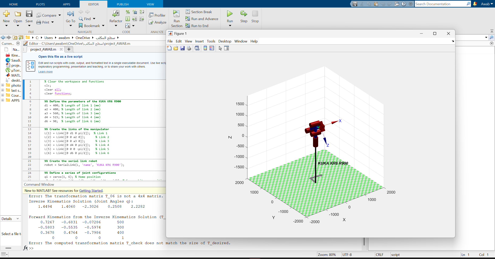

# 🤖 KUKA KR6 R900 Kinematics Analysis  

🚀 **MATLAB-based kinematics simulation for the KUKA KR6 R900 industrial robot.**  
This project includes **forward & inverse kinematics analysis**, robot motion simulation, and a detailed research paper.  

---

## 📌 Project Overview  
The **KUKA KR6 R900 ("Agilus")** is a **6-DOF industrial robot** used for automation, precision handling, and assembly.  
This repository provides:  
✅ MATLAB **code for forward & inverse kinematics**  
✅ **Robot motion simulation** using the Robotics Toolbox  
✅ A **research paper** analyzing the kinematics of the robot  

---

## 🚀 Features  
✔ **Forward Kinematics** – Computes end-effector position & orientation  
✔ **Inverse Kinematics** – Solves joint angles for a target position  
✔ **Robot Motion Simulation** – Visualizes movement through various joint configurations  
✔ **Denavit-Hartenberg (D-H) Parameters** – Used for transformation calculations  

---

## 🛠️ How to Run the Code  

### **1️⃣ Install Requirements**  
- **MATLAB** (tested on latest version)  
- **Robotics Toolbox** (Peter Corke's Robotics Toolbox for MATLAB)  
  - Install via MATLAB command:  
    ```matlab
    addpath('path_to_toolbox');
    startup_rvc
    ```

### **2️⃣ Clone the Repository**  
```sh
git clone https://github.com/AwabEEE/KUKA_Kinematics_Project.git
cd KUKA_Kinematics_Project


